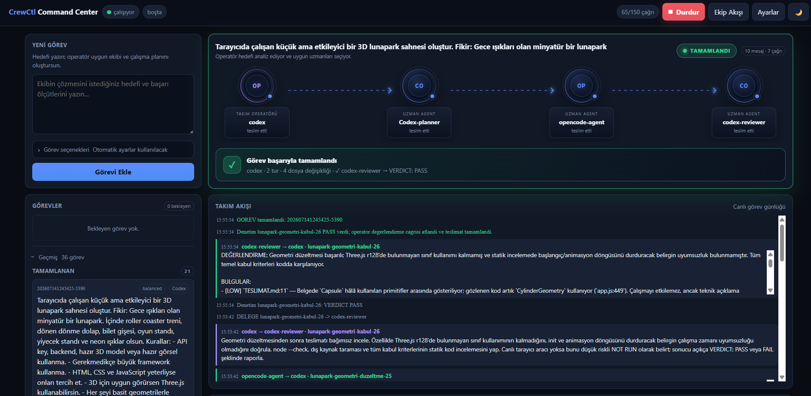

<div align="center">

# CrewCtl 🛰️

**Kurulu CLI kodlama agent'larınızı — Codex, Claude Code, Gemini ve OpenCode — tek bir operatör‑liderliğindeki takım halinde çalıştıran, sıfır bağımlılıklı, yerel ve açık kaynak Node.js çok‑agent (multi‑agent) AI orkestratörü.**

_A zero‑dependency, local, self‑hosted **multi‑agent AI orchestrator** that runs your installed CLI coding agents (OpenAI Codex, Claude Code, Google Gemini, OpenCode) as one **operator‑led team**, with a live web dashboard._

[](https://github.com/omergocmen/cli/stargazers)
[](https://github.com/omergocmen/cli/network/members)
[](https://github.com/omergocmen/cli/issues)
[](https://github.com/omergocmen/cli/commits)


[](orchestrator/LICENSE)


📖 **[Tam dokümantasyon → orchestrator/README.md](orchestrator/README.md)**




</div>

---

## 🎯 Nedir? (What is this?)

Elinizde zaten **Codex CLI**, **Claude Code**, **Gemini CLI** veya **OpenCode** varsa; bu araç onları
ayrı ayrı kullanmak yerine **tek bir yapay zeka geliştirici takımı** gibi koordine eder. Bir CLI
**operatör** rolünü üstlenir; hedefinizi analiz eder, işi alt görevlere böler, doğru uzmana
**delege eder**, sonuçları değerlendirir ve gerekirse yeni tur açar — tıpkı bir teknik lider gibi.
Her şey **yerel** çalışır, **ekstra API anahtarı gerekmez** ve **sıfır bağımlılık** ile gelir.

## ✨ Öne çıkanlar

- 🧠 **Operatör‑liderliğinde orkestrasyon** — bir CLI ekibi planlar, delege eder, değerlendirir.
- 🤝 **Çok‑agent takım** — Codex / Claude / Gemini / OpenCode uzmanlarını rollere göre kullanır.
- 🖥️ **Canlı web komuta merkezi** — takım haritası, canlı CLI terminalleri, birleşik olay akışı.
- 🛰️ **Ekip Akışı sayfası** — operatör çekirdeği + animasyonlu delegasyon akışı + ajan filosu.
- 🔎 **Otomatik CLI keşfi** — kurulu araçlar tespit edilip güvenli varsayılanlarla eklenir.
- 🧩 **Sıfır bağımlılık, yerel, taşınabilir** — Windows / macOS / Linux, `npm install` ek paket indirmez.

## 🚀 Hızlı başlangıç

**Gereksinim:** [Node.js](https://nodejs.org) 18+ ve en az bir kurulu CLI agent'ı
(Codex, Claude Code, Gemini veya OpenCode).

```bash
git clone https://github.com/omergocmen/cli.git
cd cli/orchestrator
npm install          # bağımlılık yok — yalnızca projeyi hazırlar
npm run doctor       # (opsiyonel) Node + kurulu CLI'ları kontrol eder
npm start            # sunucuyu başlatır ve tarayıcıyı açar → http://localhost:4317
```

Panel açılınca **▶ Başlat**'a basıp bir görev gönderin. `config.json` ilk çalıştırmada makinenize
göre otomatik üretilir. Ayrıntılar, ekran açıklamaları ve tüm ayarlar için:
**[orchestrator/README.md](orchestrator/README.md)**.

---

<div align="center">

### Anahtar kelimeler / Keywords

AI agent orchestrator · multi-agent orchestration · CLI agent orchestrator · operator-led agent team ·
OpenAI **Codex CLI** · **Claude Code** · Google **Gemini CLI** · **OpenCode** · autonomous coding agents ·
local / self-hosted AI dev tool · zero-dependency Node.js · web command center · yapay zeka geliştirici takımı ·
çok-agent orkestratör · yerel yapay zeka geliştirme aracı

**Lisans:** [MIT](orchestrator/LICENSE)

</div>
