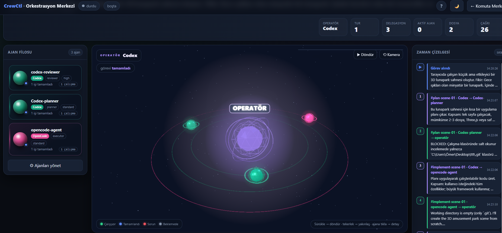

# CrewCtl 🛰️

**Kurulu CLI kodlama agent'larınızı — Codex, Claude Code, Gemini ve OpenCode — tek bir operatör liderliğindeki ekip olarak çalıştıran yerel, açık kaynak ve sıfır runtime bağımlılıklı Node.js orkestratörü.**

_A local, self-hosted, zero-dependency multi-agent AI orchestrator with an operator-led team and a live web command center._

📖 **[Tam dokümantasyon → orchestrator/README.md](orchestrator/README.md)**

---

## CrewCtl nedir?

CrewCtl, makinenizde zaten kurulu ve oturum açılmış **Codex CLI**, **Claude Code**, **Gemini CLI** ve **OpenCode** araçlarını tek bir geliştirici takımı halinde koordine eder.

Bir CLI **operatör** rolünü üstlenir; hedefi analiz eder, işi planlar, uygun uzman agent'a delege eder, sonuçları inceler ve gerekirse yeni bir tur başlatır. Uzmanlar her delegasyonda ayrı CLI prosesleri olarak çalışır. CrewCtl ayrı bir servis ya da kendine ait API anahtarı istemez; mevcut CLI oturumlarınızı kullanır ve çalışma verilerini yerelde tutar.

~~~text
Görev → Operatör planı → Uzman agent'lar → İnceleme → Teslimat
                    ↘ canlı akış + canlı kod + olay geçmişi
~~~

## Canlı görünürlük

### 🛰️ Ekip Akışı

Ekip Akışı, orkestrasyonu yalnızca log satırlarıyla değil, canlı bir 3B çalışma sahnesiyle gösterir.

  

- **Sol — Agent filosu:** Her agent'ın CLI sağlayıcısı, rolü, durumu ve tamamladığı çalışma sayısı görünür.
- **Orta — 3B orkestrasyon sahnesi:** Operatör çekirdeği ve agent gezegenleri birlikte izlenir. Bağlantı çizgisi ile ok, hedef agent'ın CLI rengini kullanır; ölçülü veri paketleri operatörden çalışan agenta doğru akar.
- **Sağ — Zaman çizelgesi:** Görevin alınmasından planlama, delegasyon ve sonuca kadar tüm olaylar kronolojik olarak gösterilir.
- **Üst KPI'lar:** Tur, delegasyon, aktif agent, değişen dosya ve CLI çağrısı sayıları tek bakışta izlenir.
- **Etkileşim:** Sahne döndürülebilir, yakınlaştırılabilir ve agent'lara tıklanarak çalışma ayrıntıları açılabilir.

### 🧬 Canlı Kod

Canlı Kod sayfası, agent'ların çalışma klasöründe yaptığı değişiklikleri Git ekranına benzer biçimde sunar:

- dosya bazında ekleme ve silme sayaçları,
- hunk başlıkları ile eski/yeni satır numaraları,
- eklenen, silinen ve bağlam satırlarının ayrı renklerle gösterimi,
- aktif görevin geçmiş değişikliklerini sayfa açıldığında otomatik yükleme,
- hassas, ikili, çok büyük veya okunamayan dosyalarda güvenli içerik gizleme.

### Kesintisiz görev geçmişi

Komuta Merkezi veya Canlı Kod sayfasından başka bir ekrana gidip geri döndüğünüzde görünüm sıfırdan başlamaz. CrewCtl aktif görevi; aktif görev yoksa son tamamlanan ya da başarısız görevi otomatik seçer, kaydedilmiş olayları geri oynatır ve bu sırada gelen canlı SSE olaylarını yinelenmeden ekrana işler.

## Görev güvenliği

- **Otomatik sürüm:** Varsayılan yapılandırmada CrewCtl, agent'lar çalışmaya başlamadan önce çalışma klasörünün bir checkpoint'ini alır.
- **Tek tıkla geri dönüş:** Tamamlanan veya başarısız görev kartındaki **Bu sürüme dön** eylemi, değiştirilmiş ve silinmiş dosyaları geri getirir; görevden sonra oluşan dosyaları kaldırır.
- **Geri almanın geri alınması:** Bir checkpoint geri yüklenmeden önce mevcut durum için yeni bir redo checkpoint'i oluşturulur.
- **Risk onayı:** Riskli görülen planlar yürütülmeden önce açık onay bekler.
- **Dayanıklılık:** Sessizlik zaman aşımı, proses ağacı sonlandırma, yeniden deneme ve uygun agent'a fallback mekanizmaları uzun çalışmaların kontrolünü korur.

> Sürüm geri yükleme yalnızca motor boşta olduğunda yapılabilir. Önemli çalışmalar için normal Git akışınızı kullanmaya devam etmeniz önerilir.

## Öne çıkan özellikler

| Özellik | Açıklama |
| --- | --- |
| Operatör liderliğinde orkestrasyon | Planlama, delegasyon, değerlendirme, yeniden deneme ve teslimat döngüsü |
| Çoklu CLI desteği | Codex, Claude Code, Gemini ve OpenCode profillerini aynı takımda kullanma |
| Çalışma modları | Görevin kapsamına göre Auto, Fast, Balanced ve Deep yürütme seçenekleri |
| Otomatik CLI keşfi | Kurulu araçları, modelleri ve çalışmaya hazır olma durumunu algılama |
| Rol ve skill yönlendirme | Planner, executor, reviewer gibi roller ile yerel skill eşleştirme |
| Canlı Komuta Merkezi | Kuyruk, terminaller, birleşik aktivite akışı, bütçe ve motor kontrolleri |
| Kalıcı olay geçmişi | Görev olaylarını JSONL olarak saklama ve sayfalar arasında otomatik geri oynatma |
| Yerel ve taşınabilir | Node.js 18+, sıfır runtime bağımlılığı, Windows/macOS/Linux desteği |

## Hızlı başlangıç

**Gereksinim:** [Node.js](https://nodejs.org) 18+ ve en az bir kurulu, oturum açılmış CLI agent'ı.

~~~bash
git clone https://github.com/omergocmen/cli.git
cd cli/orchestrator
npm install
npm run doctor
npm start
~~~

Arayüz varsayılan olarak [http://localhost:4317](http://localhost:4317) adresinde açılır. Panelde çalışma klasörünü seçin, operatör ve agent profillerini kontrol edin, ardından bir görev ekleyip **Başlat** düğmesine basın. Makineye özel <code>config.json</code> ilk çalıştırmada otomatik üretilir.

### CLI kullanımı

~~~bash
npm run cli -- status
npm run cli -- task "Testleri çalıştır ve bulunan hataları düzelt" --mode balanced
npm run cli -- run --once
npm run cli -- approvals
~~~

Global <code>crewctl</code> komutunu kullanmak isterseniz:

~~~bash
npm link
crewctl start
~~~

## Geliştirme ve doğrulama

~~~bash
cd orchestrator
npm test
~~~

Test paketi CLI, dashboard smoke, skill, Ekip Akışı, canlı diff ve checkpoint senaryolarını kapsar. Yapılandırma, çalışma modları, veri dizinleri, API uçları ve sorun giderme notları için **[tam dokümantasyona](orchestrator/README.md)** bakın.

---

### Anahtar kelimeler / Keywords

AI agent orchestrator · multi-agent orchestration · CLI agent orchestrator · operator-led agent team ·
OpenAI **Codex CLI** · **Claude Code** · Google **Gemini CLI** · **OpenCode** · autonomous coding agents ·
local / self-hosted AI dev tool · zero-dependency Node.js · live code diff · agent team visualization ·
yapay zeka geliştirici takımı · çok-agent orkestratör · yerel yapay zeka geliştirme aracı

**Lisans:** [MIT](orchestrator/LICENSE)

